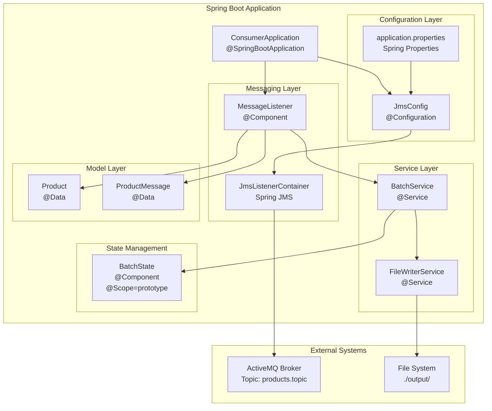
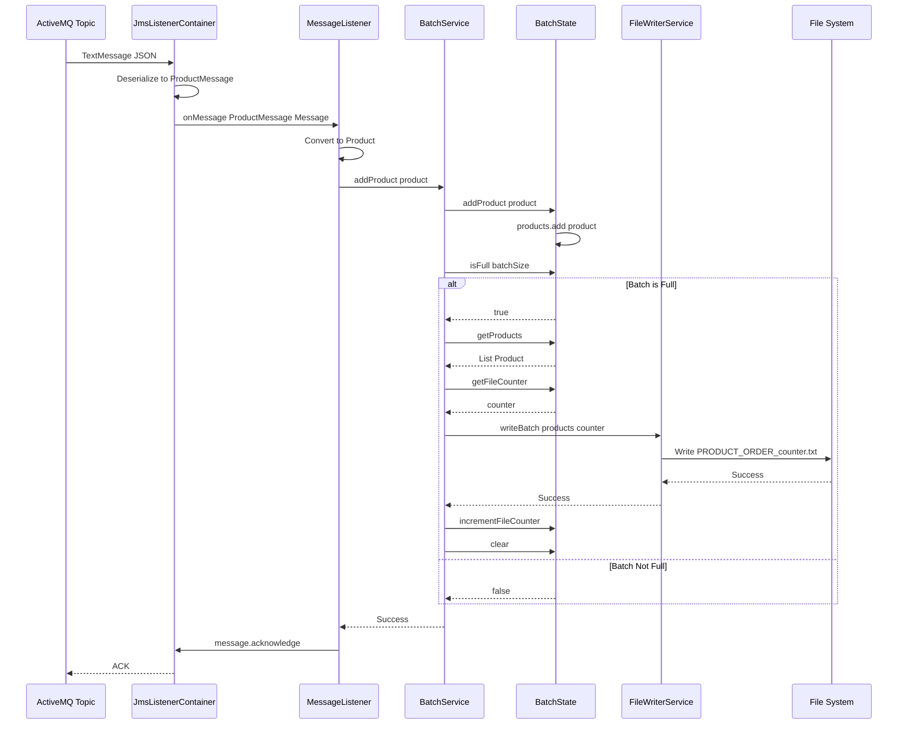
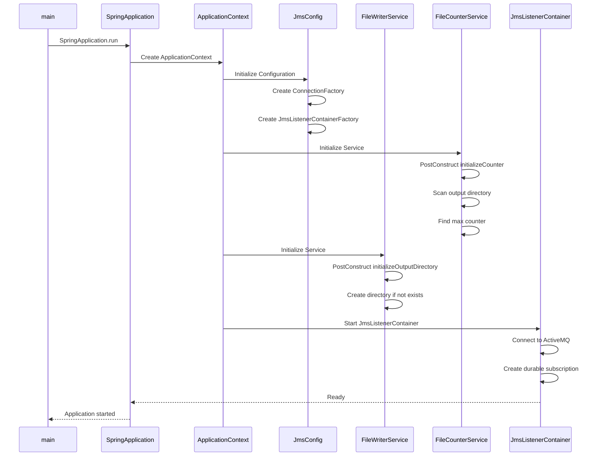
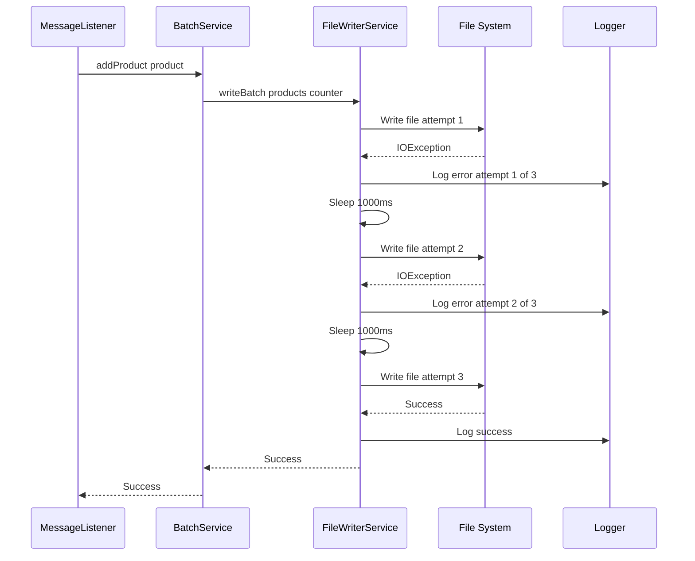

# Design Document: Consumer Spring and Lombok Refactor

## Overview

This design document outlines the refactoring of the existing consumer application to leverage Spring Framework and Lombok. The consumer currently processes messages from ActiveMQ topics using durable subscriptions and writes them to batch files. The refactoring will modernize the codebase by introducing Spring's dependency injection, configuration management, and JMS support, while using Lombok to eliminate boilerplate code. The core functionality—consuming messages, batching products, and writing to files—will remain unchanged, but the implementation will be more maintainable, testable, and aligned with modern Java development practices.

## Architecture

The refactored architecture introduces Spring Boot as the application framework, organizing components into clear layers with dependency injection managing all relationships.



## Components and Interfaces

### Component 1: ConsumerApplication

**Purpose**: Spring Boot application entry point that bootstraps the application context and manages lifecycle.

**Interface**:
```java
@SpringBootApplication
@EnableJms
public class ConsumerApplication {
  public static void main(String[] args)
}
```

**Responsibilities**:
- Bootstrap Spring Boot application context
- Enable JMS listener support
- Configure component scanning
- Handle graceful shutdown via Spring lifecycle

**Spring Annotations**:
- `@SpringBootApplication`: Enables auto-configuration, component scanning, and configuration
- `@EnableJms`: Activates JMS listener container factory and annotation-driven listener endpoints

---

### Component 2: JmsConfig

**Purpose**: Centralized JMS configuration for ActiveMQ connection factory, listener container factory, and message converter.

**Interface**:
```java
@Configuration
public class JmsConfig {
  @Bean
  public ConnectionFactory connectionFactory(
    @Value("${activemq.broker.url}") String brokerUrl,
    @Value("${activemq.client.id}") String clientId
  )
  
  @Bean
  public DefaultJmsListenerContainerFactory jmsListenerContainerFactory(
    ConnectionFactory connectionFactory
  )
  
  @Bean
  public MessageConverter messageConverter()
}
```

**Responsibilities**:
- Create and configure ActiveMQ connection factory with client ID for durable subscriptions
- Configure JMS listener container factory with CLIENT_ACKNOWLEDGE mode
- Provide Jackson-based message converter for JSON deserialization
- Inject configuration properties from application.properties

**Configuration Properties**:
- `activemq.broker.url`: ActiveMQ broker connection URL
- `activemq.client.id`: Client ID for durable subscriptions
- `activemq.topic.name`: Topic name to subscribe to
- `activemq.subscription.name`: Durable subscription name

---

### Component 3: MessageListener

**Purpose**: JMS message listener that receives messages from ActiveMQ topic and delegates to batch service.

**Interface**:
```java
@Component
public class MessageListener {
  public MessageListener(BatchService batchService)
  
  @JmsListener(
    destination = "${activemq.topic.name}",
    subscription = "${activemq.subscription.name}",
    containerFactory = "jmsListenerContainerFactory"
  )
  public void onMessage(ProductMessage message, Message jmsMessage)
}
```

**Responsibilities**:
- Listen to configured ActiveMQ topic with durable subscription
- Deserialize JSON messages to ProductMessage objects
- Convert ProductMessage to Product domain model
- Delegate product processing to BatchService
- Acknowledge messages after successful processing
- Handle message processing errors with logging

**Spring Annotations**:
- `@Component`: Marks as Spring-managed bean
- `@JmsListener`: Declares method as JMS message listener with durable subscription
- `@Slf4j` (Lombok): Generates logger field

---

### Component 4: BatchService

**Purpose**: Manages batch state and coordinates batch writing when batch size threshold is reached.

**Interface**:
```java
@Service
public class BatchService {
  public BatchService(
    BatchState batchState,
    FileWriterService fileWriterService,
    @Value("${batch.size}") int batchSize
  )
  
  public synchronized void addProduct(Product product)
  
  public synchronized void flush()
}
```

**Responsibilities**:
- Add products to current batch
- Check if batch is full based on configured batch size
- Trigger file writing when batch threshold is reached
- Provide manual flush capability for graceful shutdown
- Thread-safe batch operations using synchronization

**Configuration Properties**:
- `batch.size`: Maximum number of products per batch file

---

### Component 5: FileWriterService

**Purpose**: Writes batches of products to numbered text files with retry logic and error handling.

**Interface**:
```java
@Service
public class FileWriterService {
  public FileWriterService(
    @Value("${output.directory.path}") String outputDirectory,
    @Value("${file.writer.max-retry-attempts:3}") int maxRetryAttempts,
    @Value("${file.writer.retry-delay-ms:1000}") int retryDelayMs
  )
  
  public void writeBatch(List<Product> products, int fileCounter)
  
  @PostConstruct
  public void initializeOutputDirectory()
}
```

**Responsibilities**:
- Initialize output directory on startup (create if not exists)
- Write product batches to files with format `PRODUCT_ORDER_{counter}.txt`
- Implement retry logic with configurable attempts and delay
- Handle I/O errors with comprehensive logging
- Format product data as pipe-delimited lines: `orderId|productId`

**Configuration Properties**:
- `output.directory.path`: Directory path for output files
- `file.writer.max-retry-attempts`: Maximum retry attempts for file writes (default: 3)
- `file.writer.retry-delay-ms`: Delay between retry attempts in milliseconds (default: 1000)

---

### Component 6: FileCounterService

**Purpose**: Initializes and manages the file counter by scanning existing output files.

**Interface**:
```java
@Service
public class FileCounterService {
  public FileCounterService(
    @Value("${output.directory.path}") String outputDirectory
  )
  
  @PostConstruct
  public int initializeCounter()
  
  public int getNextCounter()
}
```

**Responsibilities**:
- Scan output directory for existing `PRODUCT_ORDER_*.txt` files on startup
- Parse file names to find maximum counter value
- Initialize counter to max + 1 for new files
- Provide thread-safe counter increment
- Handle directory creation and validation

---

### Component 7: BatchState

**Purpose**: Maintains current batch state including product list and file counter.

**Interface**:
```java
@Component
@Scope(ConfigurableBeanFactory.SCOPE_PROTOTYPE)
public class BatchState {
  public BatchState(FileCounterService fileCounterService)
  
  public synchronized void addProduct(Product product)
  
  public synchronized boolean isFull(int maxSize)
  
  public synchronized List<Product> getProducts()
  
  public synchronized int getCurrentSize()
  
  public synchronized void clear()
  
  public synchronized int getFileCounter()
  
  public synchronized void incrementFileCounter()
}
```

**Responsibilities**:
- Store products in current batch
- Track current file counter
- Provide thread-safe batch operations
- Check batch fullness against configurable size
- Clear batch after successful write
- Increment file counter after each batch write

**Spring Annotations**:
- `@Component`: Marks as Spring-managed bean
- `@Scope(SCOPE_PROTOTYPE)`: Creates new instance per injection (if needed for multi-consumer scenarios)

---

## Data Models

### Model 1: Product

```java
@Data
@AllArgsConstructor
@NoArgsConstructor
public class Product {
  private String orderId;
  private String productId;
}
```

**Validation Rules**:
- `orderId` must not be null or empty
- `productId` must not be null or empty

**Lombok Annotations**:
- `@Data`: Generates getters, setters, toString, equals, hashCode
- `@AllArgsConstructor`: Generates constructor with all fields
- `@NoArgsConstructor`: Generates no-args constructor (required for Jackson)

---

### Model 2: ProductMessage

```java
@Data
@NoArgsConstructor
@AllArgsConstructor
public class ProductMessage {
  private String orderId;
  private String productId;
}
```

**Purpose**: DTO for deserializing JSON messages from ActiveMQ

**Validation Rules**:
- `orderId` must not be null or empty
- `productId` must not be null or empty

**Lombok Annotations**:
- `@Data`: Generates getters, setters, toString, equals, hashCode
- `@NoArgsConstructor`: Required for Jackson deserialization
- `@AllArgsConstructor`: Convenience constructor

---

## Sequence Diagrams

### Main Message Processing Flow



### Application Startup Flow



### Error Handling Flow



---

## Correctness Properties

*A property is a characteristic or behavior that should hold true across all valid executions of a system—essentially, a formal statement about what the system should do. Properties serve as the bridge between human-readable specifications and machine-verifiable correctness guarantees.*

### Property 1: Message Acknowledgment Guarantee

*For any* message received from ActiveMQ, the message is acknowledged if and only if the product has been successfully added to the batch state.

**Validates: Requirements 1.4**

---

### Property 2: Message Deserialization Round-Trip

*For any* valid Product_Message object, serializing it to JSON and then deserializing it back should produce an equivalent object.

**Validates: Requirements 1.3**

---

### Property 3: Invalid Message Error Handling

*For any* malformed JSON message that cannot be deserialized, the system should log the error, acknowledge the message, and continue processing subsequent messages without crashing.

**Validates: Requirements 1.5**

---

### Property 4: Batch Size Invariant

*For any* batch state at any point in time, the number of products in the current batch never exceeds the configured batch size.

**Validates: Requirements 2.4**

---

### Property 5: Batch Write Atomicity

*For any* batch write operation, either all products in the batch are written to the file, or none are written (no partial writes occur).

**Validates: Requirements 3.6**

---

### Property 6: File Name Format Consistency

*For any* batch write with file counter value N, the created file name is exactly `PRODUCT_ORDER_N.txt`.

**Validates: Requirements 3.1**

---

### Property 7: Product Formatting Consistency

*For any* product with orderId O and productId P, the formatted line in the batch file is exactly `O|P`.

**Validates: Requirements 3.2**

---

### Property 8: File Counter Monotonicity

*For any* two batch writes W1 and W2 where W1 occurs before W2, the file counter value for W2 is strictly greater than the file counter value for W1.

**Validates: Requirements 4.4, 4.6**

---

### Property 9: File Name Uniqueness

*For any* two different batch writes, the generated file names are different (no file overwrites occur).

**Validates: Requirements 4.5**

---

### Property 10: File Counter Initialization Correctness

*For any* set of existing batch files in the output directory at startup, the initialized file counter is exactly one greater than the maximum counter value found in existing file names.

**Validates: Requirements 4.2, 4.3**

---

### Property 11: Configuration Validation Completeness

*For any* application startup attempt, if any required configuration property is missing or has an invalid value, the application fails to start with a validation error message.

**Validates: Requirements 6.4, 6.5**

---

### Property 12: Thread-Safe Batch Operations

*For any* sequence of concurrent product additions to the batch state, the final batch state is consistent and contains exactly the products that were added (no race conditions or lost updates).

**Validates: Requirements 8.1**

---

### Property 13: Product Validation

*For any* Product or Product_Message creation attempt, if orderId or productId is null or empty, the creation is rejected with a validation error.

**Validates: Requirements 11.1, 11.2, 11.3, 11.4**

---

## Error Handling

### Error Scenario 1: Message Deserialization Failure

**Condition**: Received message cannot be deserialized to ProductMessage (malformed JSON, missing fields)

**Response**: 
- Log error with message details
- Acknowledge message to prevent redelivery
- Continue processing subsequent messages

**Recovery**: No recovery needed; message is discarded as invalid

---

### Error Scenario 2: File Write Failure

**Condition**: IOException occurs when writing batch to file (disk full, permissions, I/O error)

**Response**:
- Retry write up to 3 times with 1-second delay
- Log each retry attempt
- If all retries fail, log critical error with batch details
- Acknowledge message to prevent infinite redelivery loop

**Recovery**: Manual intervention required; batch data is lost after max retries

---

### Error Scenario 3: ActiveMQ Connection Loss

**Condition**: Network failure or broker restart causes connection loss

**Response**:
- Spring JMS automatically attempts reconnection
- Log connection loss and reconnection attempts
- Durable subscription ensures no message loss

**Recovery**: Automatic reconnection by Spring JMS; messages delivered after reconnection

---

### Error Scenario 4: Output Directory Not Writable

**Condition**: Output directory doesn't exist, cannot be created, or lacks write permissions

**Response**:
- Fail application startup with clear error message
- Log directory path and permission details

**Recovery**: Fix directory permissions or configuration, then restart application

---

### Error Scenario 5: Invalid Configuration

**Condition**: Required configuration properties are missing or invalid (e.g., negative batch size)

**Response**:
- Fail application startup with validation error
- Log specific configuration issue

**Recovery**: Correct configuration in application.properties, then restart application

---

## Testing Strategy

### Unit Testing Approach

**Scope**: Test individual components in isolation using mocks

**Key Test Cases**:
- `MessageListener`: Verify message deserialization, product conversion, batch service delegation, acknowledgment
- `BatchService`: Verify product addition, batch fullness detection, file service coordination
- `FileWriterService`: Verify file writing, retry logic, error handling, file format
- `FileCounterService`: Verify counter initialization from existing files, directory creation
- `BatchState`: Verify thread-safe operations, batch management, counter tracking

**Mocking Strategy**:
- Mock JMS Message for listener tests
- Mock FileWriterService for batch service tests
- Mock File I/O for file writer tests
- Use Mockito for all mocking

**Coverage Goals**: 80% line coverage, 90% branch coverage

---

### Property-Based Testing Approach

**Property Test Library**: jqwik (already in project dependencies)

**Key Properties to Test**:

1. **Batch Size Invariant**: Generate random sequences of products, verify batch size never exceeds maximum
2. **File Counter Monotonicity**: Generate random batch writes, verify counter always increases
3. **Message Acknowledgment**: Generate random message processing scenarios, verify acknowledgment only on success
4. **File Name Uniqueness**: Generate random batch writes, verify no duplicate file names

**Test Data Generators**:
- Random Product instances with valid orderId and productId
- Random batch sizes (1-100)
- Random file counter values
- Random I/O failure scenarios

---

### Integration Testing Approach

**Scope**: Test component interactions with real Spring context and embedded ActiveMQ

**Key Integration Tests**:

1. **End-to-End Message Flow**: 
   - Start embedded ActiveMQ broker
   - Publish messages to topic
   - Verify batch files created with correct content
   - Verify file counter increments correctly

2. **Durable Subscription Persistence**:
   - Publish messages while consumer is stopped
   - Start consumer
   - Verify all messages are delivered and processed

3. **Configuration Loading**:
   - Test with various application.properties configurations
   - Verify correct bean initialization
   - Verify startup failure with invalid configuration

4. **Graceful Shutdown**:
   - Send messages during shutdown
   - Verify in-progress batch is flushed
   - Verify no message loss

**Test Framework**: Spring Boot Test with `@SpringBootTest`, embedded ActiveMQ

---

## Performance Considerations

### Throughput Optimization

- **Batch Processing**: Configurable batch size allows tuning for throughput vs. latency trade-off
- **Asynchronous Processing**: JMS listener processes messages asynchronously without blocking
- **Connection Pooling**: Spring JMS provides connection pooling for efficient resource usage

### Memory Management

- **Batch Size Limit**: Prevents unbounded memory growth by limiting products in memory
- **Immediate File Write**: Batches are written to disk immediately when full, freeing memory
- **Prototype Scope**: BatchState can be prototype-scoped for multi-consumer scenarios

### Scalability

- **Horizontal Scaling**: Multiple consumer instances can run with different client IDs
- **Durable Subscriptions**: Each consumer instance maintains its own durable subscription
- **File Counter Coordination**: File counter service ensures unique file names per instance

---

## Security Considerations

### ActiveMQ Authentication

- **Connection Security**: Support for username/password authentication via Spring properties
- **SSL/TLS**: Can be configured for encrypted broker connections
- **Configuration**: Add `spring.activemq.user` and `spring.activemq.password` properties

### File System Security

- **Directory Permissions**: Validate write permissions on startup
- **Path Traversal Prevention**: Use Path API to prevent directory traversal attacks
- **File Permissions**: Written files inherit directory permissions

### Configuration Security

- **Sensitive Properties**: Use Spring Cloud Config or environment variables for sensitive values
- **Property Encryption**: Support for encrypted properties via Spring Cloud Config
- **No Hardcoded Secrets**: All configuration externalized to application.properties

---

## Dependencies

### New Dependencies (to be added to pom.xml)

```xml
<!-- Spring Boot Starter -->
<dependency>
    <groupId>org.springframework.boot</groupId>
    <artifactId>spring-boot-starter</artifactId>
    <version>3.2.0</version>
</dependency>

<!-- Spring Boot JMS Starter -->
<dependency>
    <groupId>org.springframework.boot</groupId>
    <artifactId>spring-boot-starter-activemq</artifactId>
    <version>3.2.0</version>
</dependency>

<!-- Lombok -->
<dependency>
    <groupId>org.projectlombok</groupId>
    <artifactId>lombok</artifactId>
    <version>1.18.30</version>
    <scope>provided</scope>
</dependency>

<!-- Spring Boot Test -->
<dependency>
    <groupId>org.springframework.boot</groupId>
    <artifactId>spring-boot-starter-test</artifactId>
    <version>3.2.0</version>
    <scope>test</scope>
</dependency>
```

### Existing Dependencies (to be retained)

- Jackson Databind (for JSON processing)
- SLF4J and Logback (for logging)
- JUnit Jupiter (for unit testing)
- jqwik (for property-based testing)
- Mockito (for mocking)

### Dependencies to be Removed

- Direct ActiveMQ Client dependency (replaced by spring-boot-starter-activemq)

---

## Migration Strategy

### Phase 1: Add Dependencies
- Add Spring Boot, Spring JMS, and Lombok to pom.xml
- Update parent POM if needed for Spring Boot dependency management

### Phase 2: Refactor Models
- Add Lombok annotations to Product class
- Create ProductMessage DTO with Lombok annotations

### Phase 3: Create Configuration
- Create JmsConfig with connection factory and listener container factory
- Keep application.properties format (no conversion to YAML needed)
- Add Spring-specific properties

### Phase 4: Refactor Services
- Create FileCounterService from FileCounterInitializer
- Create FileWriterService from BatchFileWriter
- Create BatchService to coordinate batch operations
- Add Spring annotations and constructor injection

### Phase 5: Refactor Messaging
- Create MessageListener from MessageConsumer
- Add @JmsListener annotation
- Integrate with BatchService

### Phase 6: Refactor Application Entry Point
- Convert ConsumerApplication to Spring Boot application
- Remove manual initialization code
- Add @SpringBootApplication and @EnableJms

### Phase 7: Testing
- Update existing tests for Spring context
- Add integration tests with embedded ActiveMQ
- Add property-based tests with jqwik

### Phase 8: Validation
- Test with real ActiveMQ broker
- Verify durable subscription behavior
- Verify batch file creation and content
- Performance testing with high message volume
