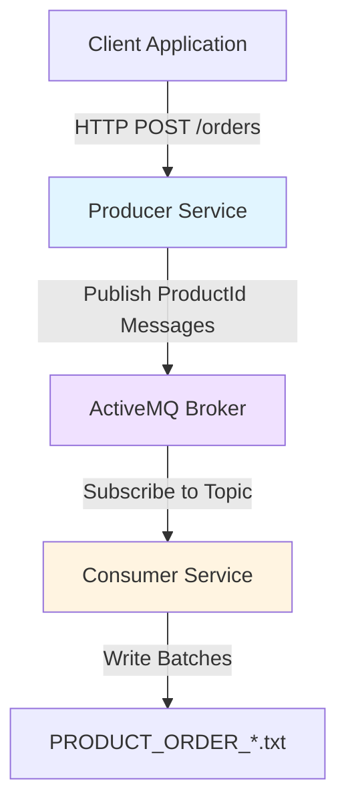
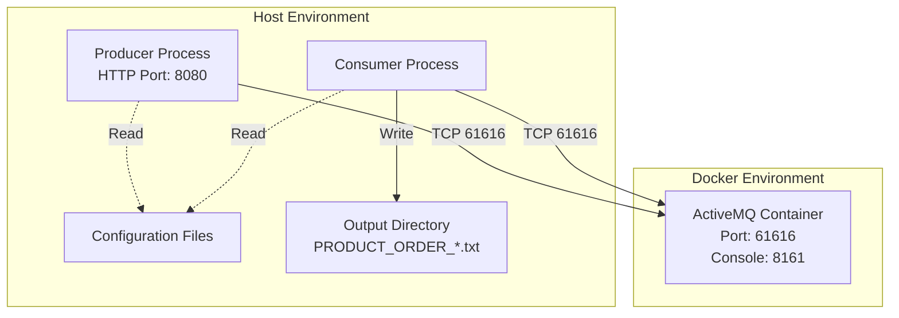

# Design Document: Order Processing Service

## Overview

The Order Processing Service is a distributed messaging system built on a producer-consumer architecture. The system receives HTTP order requests, decomposes them into individual product messages, and processes these products in batches for persistent storage.

### System Components

1. **Producer Service**: HTTP server that receives order requests and publishes product messages to ActiveMQ
2. **Consumer Service**: Message processor that batches product IDs and persists them to disk
3. **ActiveMQ Broker**: Message broker providing publish-subscribe messaging via topics
4. **Persistent Storage**: Text file storage for processed product batches

### Key Design Decisions

- **Topic-based messaging**: Using ActiveMQ topics allows multiple consumers to process messages independently if needed in the future
- **Batch processing**: Accumulating products in memory before writing reduces I/O operations and improves throughput
- **Separate batch files**: Each batch is written to a uniquely numbered file, providing clear batch boundaries and easier tracking
- **Pipe-delimited format**: ORDER_ID|PRODUCT_ID format preserves the relationship between orders and products in the output
- **Manual acknowledgment**: Ensures no message loss during failures by acknowledging only after successful processing
- **Exponential backoff**: Prevents overwhelming the broker during reconnection attempts

## Architecture

### High-Level Architecture



### Component Interaction Flow

1. Client sends HTTP POST request with order data to Producer
2. Producer validates request and extracts orderId and productIds
3. Producer publishes each productId as a separate message to ActiveMQ topic
4. Producer returns HTTP 202 Accepted to client
5. Consumer receives messages from ActiveMQ topic
6. Consumer accumulates products (orderId and productId pairs) in memory batch
7. When batch reaches size threshold (5), Consumer writes to new numbered file
8. Consumer acknowledges messages to ActiveMQ

### Deployment Architecture



## Components and Interfaces

### Producer Service

**Responsibilities:**
- Accept and validate HTTP order requests
- Extract order and product information
- Publish product messages to ActiveMQ
- Handle connection failures and reconnection
- Provide appropriate HTTP responses

**HTTP Interface:**

```
POST /orders
Content-Type: application/json

Request Body:
{
  "orderId": "string",
  "productIds": ["string", "string", ...]
}

Response Codes:
- 202 Accepted: Order accepted and products published
- 400 Bad Request: Missing orderId or productIds
- 503 Service Unavailable: ActiveMQ connection unavailable
```

**Configuration Parameters:**
- `activemq.broker.url`: ActiveMQ broker connection URL (e.g., "tcp://localhost:61616")
- `http.server.port`: HTTP server listening port (e.g., 8080)
- `activemq.topic.name`: Topic name for product messages (e.g., "products.topic")

**Message Publishing Interface:**

```
Topic: products.topic
Message Format:
{
  "orderId": "string",
  "productId": "string"
}
```

### Consumer Service

**Responsibilities:**
- Initialize file counter from existing files on startup
- Subscribe to ActiveMQ product topic
- Extract product information from messages
- Accumulate products (orderId and productId pairs) in memory batch
- Write batches to separate numbered files
- Track file counter across batches
- Acknowledge messages after successful processing
- Handle connection failures and reconnection

**Startup Sequence:**
1. Load configuration parameters
2. Scan output directory for existing PRODUCT_ORDER_*.txt files
3. Extract counter values from existing file names
4. Initialize file counter to (max counter + 1) or 1 if no files exist
5. Log initialized file counter value
6. Establish connection to ActiveMQ
7. Subscribe to product topic
8. Begin message consumption

**Configuration Parameters:**
- `activemq.broker.url`: ActiveMQ broker connection URL
- `activemq.topic.name`: Topic name for product messages
- `output.directory.path`: Path to output directory (e.g., "./output")
- `batch.size`: Number of products per batch (e.g., 5)

**File Output Format:**

Each batch is written to a separate file named `PRODUCT_ORDER_x.txt` where x is an incrementing counter starting from 1.

File naming examples:
```
PRODUCT_ORDER_1.txt
PRODUCT_ORDER_2.txt
PRODUCT_ORDER_3.txt
```

Each line in the file contains ORDER_ID|PRODUCT_ID (pipe-delimited):
```
ORD-123|PROD-456
ORD-123|PROD-789
ORD-456|PROD-111
ORD-789|PROD-222
ORD-789|PROD-333
```

**File Counter Initialization Algorithm:**

On Consumer startup, the file counter must be initialized to resume from existing files:

```
Algorithm: InitializeFileCounter(outputDirectory)
  Input: outputDirectory - path to output directory
  Output: fileCounter - starting counter value

  1. If outputDirectory does not exist:
       Create outputDirectory
       Return 1
  
  2. If outputDirectory is not readable:
       Log error "Cannot read output directory: {outputDirectory}"
       Fail to start Consumer
  
  3. List all files in outputDirectory matching pattern "PRODUCT_ORDER_*.txt"
  
  4. If no matching files found:
       Return 1
  
  5. Initialize maxCounter = 0
  
  6. For each matching file:
       a. Extract filename (e.g., "PRODUCT_ORDER_5.txt")
       b. Parse counter value from filename:
          - Remove "PRODUCT_ORDER_" prefix
          - Remove ".txt" suffix
          - Parse remaining string as integer
       c. If parsing fails:
          - Log warning "Skipping file with invalid name format: {filename}"
          - Continue to next file
       d. If counter > maxCounter:
          - maxCounter = counter
  
  7. Return maxCounter + 1
```

**Example Scenarios:**

Scenario 1: No existing files
- Output directory is empty
- File counter initializes to 1
- First batch writes to PRODUCT_ORDER_1.txt

Scenario 2: Existing files present
- Output directory contains: PRODUCT_ORDER_1.txt, PRODUCT_ORDER_2.txt, PRODUCT_ORDER_3.txt
- Maximum counter = 3
- File counter initializes to 4
- Next batch writes to PRODUCT_ORDER_4.txt

Scenario 3: Gaps in file sequence
- Output directory contains: PRODUCT_ORDER_1.txt, PRODUCT_ORDER_3.txt, PRODUCT_ORDER_7.txt
- Maximum counter = 7 (gaps are ignored)
- File counter initializes to 8
- Next batch writes to PRODUCT_ORDER_8.txt

Scenario 4: Corrupted file names
- Output directory contains: PRODUCT_ORDER_1.txt, PRODUCT_ORDER_abc.txt, PRODUCT_ORDER_3.txt
- PRODUCT_ORDER_abc.txt is skipped with warning
- Maximum counter = 3
- File counter initializes to 4
- Next batch writes to PRODUCT_ORDER_4.txt

### ActiveMQ Broker

**Deployment:**
- Containerized using Docker Compose
- Persistent message storage using Docker volumes
- Management console exposed for monitoring

**Docker Compose Configuration:**

```yaml
version: '3.8'
services:
  activemq:
    image: apache/activemq-classic:latest
    ports:
      - "61616:61616"  # OpenWire protocol
      - "8161:8161"    # Web console
    volumes:
      - activemq-data:/opt/apache-activemq/data
    environment:
      - ACTIVEMQ_OPTS=-Xmx512m

volumes:
  activemq-data:
```

### Connection Management

**Connection Lifecycle:**

1. **Startup**: Establish connection before processing
2. **Monitoring**: Detect connection loss via exception handling
3. **Reconnection**: Exponential backoff strategy
4. **Recovery**: Resume normal operation after reconnection

**Exponential Backoff Strategy:**
- Initial delay: 1 second
- Maximum delay: 60 seconds
- Backoff multiplier: 2
- Formula: `delay = min(initial_delay * (2 ^ attempt), max_delay)`

**Producer Behavior During Reconnection:**
- Return HTTP 503 to all incoming requests
- Log reconnection attempts
- Resume accepting requests after successful reconnection

**Consumer Behavior During Reconnection:**
- Preserve current batch in memory (including file counter)
- Retry connection establishment
- Resume message consumption after reconnection

## Data Models

### Order Request

```json
{
  "orderId": "string (required, non-empty)",
  "productIds": ["string (required, non-empty array)"]
}
```

**Validation Rules:**
- `orderId`: Must be present and non-empty string
- `productIds`: Must be present, must be array, must contain at least one element

### Product Message

```json
{
  "orderId": "string",
  "productId": "string"
}
```

**Message Properties:**
- Delivery mode: Persistent (survives broker restart)
- Priority: Default (4)
- Time-to-live: Unlimited

### Batch State

**In-Memory Structure:**

```
Batch {
  products: List<Product>  // Each Product contains orderId and productId
  currentSize: Integer
  maxSize: Integer (from configuration)
  fileCounter: Integer (initialized from existing files on startup, increments after each write)
}

Product {
  orderId: String
  productId: String
}
```

**File Counter Initialization:**
- On startup: Scan output directory for PRODUCT_ORDER_*.txt files
- Extract counter values from file names
- Initialize to (max counter + 1) or 1 if no files exist
- Persists across restarts by inferring from file system state

**State Transitions:**
- Empty → Accumulating: First message received
- Accumulating → Full: Size reaches threshold
- Full → Empty: Batch written to file and cleared (fileCounter incremented)

### Configuration Model

**Producer Configuration:**
```properties
activemq.broker.url=tcp://localhost:61616
http.server.port=8080
activemq.topic.name=products.topic
```

**Consumer Configuration:**
```properties
activemq.broker.url=tcp://localhost:61616
activemq.topic.name=products.topic
output.directory.path=./output
batch.size=5
```


## Correctness Properties

*A property is a characteristic or behavior that should hold true across all valid executions of a system-essentially, a formal statement about what the system should do. Properties serve as the bridge between human-readable specifications and machine-verifiable correctness guarantees.*

### Property 1: Order Request Parsing Round-Trip

*For any* valid order request with orderId and productIds, when the Producer receives and parses the request, the extracted orderId and productIds should match the original request values.

**Validates: Requirements 1.2, 1.3**

### Property 2: Valid Order Acceptance

*For any* valid order request (containing non-empty orderId and non-empty productIds array), the Producer should return HTTP 202 Accepted response.

**Validates: Requirements 1.6**

### Property 3: Message Count Equals Product Count

*For any* order with N productIds, the Producer should publish exactly N messages to the ActiveMQ topic.

**Validates: Requirements 2.1**

### Property 4: OrderId Propagation in Messages

*For any* order with orderId and multiple productIds, every published message should contain the same orderId from the original order.

**Validates: Requirements 2.2**

### Property 5: Sequential Message Confirmation

*For any* order with multiple productIds, each message should be confirmed as sent before the next productId is processed.

**Validates: Requirements 2.3**

### Property 6: Message Parsing Round-Trip

*For any* product message received by the Consumer, extracting the orderId and productId should yield values that match the original message content.

**Validates: Requirements 3.2, 3.3**

### Property 7: Batch Accumulation Before Threshold

*For any* sequence of messages where the count is less than the batch size threshold, the Consumer should accumulate all products (orderId and productId pairs) in memory without writing to file.

**Validates: Requirements 4.1**

### Property 8: Batch Write at Threshold

*For any* batch that reaches exactly the configured batch size, the Consumer should write all products in the batch to a new file named PRODUCT_ORDER_x.txt where x is the current file counter value.

**Validates: Requirements 4.2, 4.3**

### Property 9: File Format Correctness

*For any* batch written to file, each line in the output should be formatted as "ORDER_ID|PRODUCT_ID" (pipe-delimited) with the count of lines equal to the batch size.

**Validates: Requirements 4.5**

### Property 10: Batch Clear After Write

*For any* batch that is successfully written to file, the Consumer's batch should be empty immediately after the write operation completes, and the file counter should be incremented by 1.

**Validates: Requirements 4.4, 4.6**

### Property 11: File Counter Increment

*For any* sequence of N batch writes, the Consumer should create N separate files named PRODUCT_ORDER_1.txt through PRODUCT_ORDER_N.txt with no gaps in the numbering sequence.

**Validates: Requirements 4.3, 4.4**

### Property 12: File Counter Initialization from Existing Files

*For any* output directory containing existing PRODUCT_ORDER_*.txt files with valid counter values, when the Consumer starts, the file counter should be initialized to (maximum counter value + 1), ensuring that subsequent batch writes do not overwrite existing files.

**Validates: Requirements 9.1, 9.2, 9.3, 9.4**

### Property 13: Invalid File Name Handling

*For any* output directory containing a mix of valid PRODUCT_ORDER_*.txt files and files with invalid or corrupted names, the Consumer should skip invalid files, log warnings for each skipped file, and correctly initialize the file counter from the maximum valid counter value.

**Validates: Requirements 9.8**

### Property 14: File Counter Initialization Logging

*For any* Consumer startup, the logs should contain an entry with the initialized file counter value.

**Validates: Requirements 9.9**

### Property 15: Exponential Backoff Timing

*For any* connection loss event, reconnection attempts should follow exponential backoff with delays increasing by a factor of 2 up to a maximum delay.

**Validates: Requirements 6.3, 6.4**

### Property 16: Service Unavailable During Reconnection

*For any* HTTP request received while the Producer is reconnecting to ActiveMQ, the response should be HTTP 503 Service Unavailable.

**Validates: Requirements 6.5**

### Property 17: Message Acknowledgment After Batch Add

*For any* product message successfully added to the batch, the Consumer should acknowledge the message to ActiveMQ.

**Validates: Requirements 7.1**

### Property 18: Acknowledgment Before File Write

*For any* batch written to file, all messages in that batch should have been acknowledged to ActiveMQ before the file write operation begins.

**Validates: Requirements 7.3**

### Property 19: Configuration Value Propagation

*For any* configuration parameter (broker URL, port, topic name, file path, batch size), the value specified in the configuration file should be used by the component during operation.

**Validates: Requirements 8.1, 8.2, 8.3, 8.4, 8.5, 8.6, 8.7**

### Property 20: Order Request Logging

*For any* order request received by the Producer, the logs should contain an entry with the orderId and the count of productIds.

**Validates: Requirements 10.4**

### Property 21: Message Publication Logging

*For any* productId published to ActiveMQ, the Producer logs should contain an entry with both the orderId and productId.

**Validates: Requirements 10.5**

### Property 22: Message Reception Logging

*For any* product message received by the Consumer, the logs should contain an entry with both the orderId and productId.

**Validates: Requirements 10.12**

### Property 23: Batch Addition Logging

*For any* productId added to the batch, the Consumer logs should contain an entry with the current batch size after the addition.

**Validates: Requirements 10.13**

### Property 24: Batch Write Logging

*For any* batch written to file, the Consumer logs should contain an entry with the batch size and the file name (PRODUCT_ORDER_x.txt).

**Validates: Requirements 10.14**

## Error Handling

### Producer Error Scenarios

**Invalid Request Handling:**
- Missing orderId: Return HTTP 400 with error message "orderId is required"
- Missing productIds: Return HTTP 400 with error message "productIds is required"
- Empty productIds array: Return HTTP 400 with error message "productIds cannot be empty"
- Malformed JSON: Return HTTP 400 with error message "Invalid JSON format"

**ActiveMQ Connection Errors:**
- Connection unavailable at startup: Log error, retry connection with exponential backoff, do not start HTTP server until connected
- Connection lost during operation: Log disconnection, start reconnection attempts, return HTTP 503 to all requests
- Message publish failure: Log error with orderId and productId, return HTTP 503 to client

**Reconnection Strategy:**
```
attempt = 0
while not connected:
    delay = min(1 * (2 ^ attempt), 60)  // seconds
    wait(delay)
    try_connect()
    attempt += 1
```

### Consumer Error Scenarios

**File Counter Initialization Errors:**
- Output directory does not exist: Create directory, initialize counter to 1, log directory creation
- Output directory not readable: Log critical error with directory path, fail to start Consumer
- Output directory not writable: Log critical error at startup, fail to start Consumer
- Invalid file names in directory: Log warning for each invalid file name, skip file, continue with valid files
- No valid files found: Initialize counter to 1, log initialization

**Message Processing Errors:**
- Unparseable message: Log error with message content, acknowledge message to prevent redelivery
- Missing orderId in message: Log error, acknowledge message
- Missing productId in message: Log error, acknowledge message

**Batch Processing Errors:**
- Batch add failure: Log error, do not acknowledge message, allow redelivery
- File write failure: Log error with file name and batch size, retry write operation up to 3 times with 1-second delay between attempts
- File write retry exhausted: Log critical error, acknowledge messages to prevent infinite redelivery, continue processing new messages

**ActiveMQ Connection Errors:**
- Connection unavailable at startup: Log error, retry connection with exponential backoff, do not start message consumption until connected
- Connection lost during operation: Log disconnection, preserve current batch in memory (including file counter), start reconnection attempts
- Connection restored: Log reconnection, resume message consumption with preserved batch and file counter

### Error Logging Format

All error logs should include:
- Timestamp
- Component name (Producer/Consumer)
- Error severity (ERROR/CRITICAL)
- Error message
- Contextual information (orderId, productId, file name, etc.)
- Stack trace for exceptions

Example:
```
2024-01-15 10:30:45.123 [Producer] ERROR: Failed to publish message - orderId: ORD-123, productId: PROD-456
java.io.IOException: Connection refused
    at ...
```

## Testing Strategy

### Overview

The testing strategy employs a dual approach combining property-based testing for universal correctness guarantees and unit testing for specific scenarios, edge cases, and integration points.

### Property-Based Testing

**Framework Selection:**
- **Java**: Use JUnit 5 with jqwik library for property-based testing
- **Python**: Use Hypothesis library
- **JavaScript/TypeScript**: Use fast-check library

**Configuration:**
- Minimum 100 iterations per property test
- Each test must reference its design document property using tags
- Tag format: `@Tag("Feature: order-processing-service, Property {number}: {property_text}")`

**Property Test Coverage:**

1. **Order Processing Properties (Properties 1-5)**
   - Generate random orders with varying orderId and productIds
   - Verify parsing, response codes, message counts, and orderId propagation
   - Test sequential confirmation behavior

2. **Message Consumption Properties (Properties 6-11)**
   - Generate random product messages
   - Verify message parsing, batch accumulation, file writes with correct naming (PRODUCT_ORDER_x.txt)
   - Verify file format (ORDER_ID|PRODUCT_ID)
   - Test batch clearing and file counter increment after writes
   - Test file counter sequence across multiple batches

3. **File Counter Persistence Properties (Properties 12-14)**
   - Generate random sets of existing PRODUCT_ORDER_*.txt files with various counter values
   - Verify file counter initialization to (max + 1)
   - Test handling of invalid/corrupted file names
   - Verify file counter initialization logging
   - Test scenarios: empty directory, gaps in sequence, mixed valid/invalid files

4. **Connection Management Properties (Properties 15-16)**
   - Simulate connection failures
   - Verify exponential backoff timing
   - Test HTTP 503 responses during reconnection

5. **Acknowledgment Properties (Properties 17-18)**
   - Verify acknowledgment timing relative to batch operations
   - Test acknowledgment before file writes

6. **Configuration Properties (Property 19)**
   - Generate random configuration values
   - Verify components use configured values

7. **Logging Properties (Properties 20-24)**
   - Generate random operations
   - Verify log entries contain required information

**Example Property Test (Java with jqwik):**

```java
@Property
@Tag("Feature: order-processing-service, Property 3: Message Count Equals Product Count")
void messageCountEqualsProductCount(@ForAll("orders") Order order) {
    // Given: An order with N productIds
    int expectedCount = order.getProductIds().size();
    
    // When: Producer processes the order
    List<Message> publishedMessages = producer.processOrder(order);
    
    // Then: Exactly N messages should be published
    assertEquals(expectedCount, publishedMessages.size());
}

@Provide
Arbitrary<Order> orders() {
    return Combinators.combine(
        Arbitraries.strings().alpha().ofMinLength(1),
        Arbitraries.list(Arbitraries.strings().alpha().ofMinLength(1))
            .ofMinSize(1).ofMaxSize(20)
    ).as((orderId, productIds) -> new Order(orderId, productIds));
}
```

```java
@Property
@Tag("Feature: order-processing-service, Property 12: File Counter Initialization from Existing Files")
void fileCounterInitializesFromExistingFiles(@ForAll("existingFiles") List<Integer> existingCounters) {
    // Given: An output directory with existing PRODUCT_ORDER_*.txt files
    Path tempDir = createTempDirectory();
    for (Integer counter : existingCounters) {
        createFile(tempDir, "PRODUCT_ORDER_" + counter + ".txt");
    }
    
    // When: Consumer initializes file counter
    Consumer consumer = new Consumer(tempDir);
    int initializedCounter = consumer.getFileCounter();
    
    // Then: File counter should be max + 1
    int expectedCounter = existingCounters.isEmpty() ? 1 : Collections.max(existingCounters) + 1;
    assertEquals(expectedCounter, initializedCounter);
}

@Provide
Arbitrary<List<Integer>> existingFiles() {
    return Arbitraries.list(Arbitraries.integers().between(1, 100))
        .ofMinSize(0).ofMaxSize(10)
        .map(list -> new ArrayList<>(new HashSet<>(list))); // Remove duplicates
}
```

### Unit Testing

**Focus Areas:**

1. **Edge Cases and Error Conditions**
   - Missing orderId (Requirement 1.4)
   - Missing productIds (Requirement 1.5)
   - ActiveMQ unavailable (Requirement 2.4)
   - Unparseable messages (Requirement 3.5)
   - File write failures (Requirement 4.7)
   - Batch add failures (Requirement 7.2)
   - Empty output directory (Requirement 9.5)
   - Missing output directory (Requirement 9.6)
   - Unreadable output directory (Requirement 9.7)
   - Corrupted file names in output directory (Requirement 9.8)
   - Error logging scenarios (Requirements 10.15, 10.16, 10.17, 10.18)

2. **Specific Examples**
   - HTTP endpoint exists (Requirement 1.1)
   - Consumer subscribes to topic (Requirement 3.1)
   - Consumer scans directory on startup (Requirement 9.1)
   - Docker Compose file exists (Requirement 5.1)
   - Docker Compose port configuration (Requirement 5.3)
   - Docker Compose volume configuration (Requirement 5.4)
   - Producer connects before accepting requests (Requirement 6.1)
   - Consumer connects before processing (Requirement 6.2)
   - Manual acknowledgment mode (Requirement 7.4)
   - Startup logging (Requirements 10.1, 10.2, 10.3)
   - Connection event logging (Requirements 10.6-10.11)
   - File naming format (PRODUCT_ORDER_1.txt, PRODUCT_ORDER_2.txt, etc.)
   - File content format (ORDER_ID|PRODUCT_ID)
   - File counter initialization with gaps in sequence
   - File counter initialization with mixed valid/invalid files

3. **Integration Tests**
   - End-to-end flow: HTTP request → ActiveMQ → File write
   - Producer-ActiveMQ integration
   - Consumer-ActiveMQ integration
   - File system integration

**Example Unit Test (Java with JUnit 5):**

```java
@Test
@DisplayName("Should return HTTP 400 when orderId is missing")
void shouldReturnBadRequestWhenOrderIdMissing() {
    // Given: A request without orderId
    String requestBody = "{\"productIds\": [\"PROD-1\", \"PROD-2\"]}";
    
    // When: Request is sent to Producer
    HttpResponse response = sendPostRequest("/orders", requestBody);
    
    // Then: Should return 400 Bad Request
    assertEquals(400, response.getStatusCode());
    assertTrue(response.getBody().contains("orderId is required"));
}
```

```java
@Test
@DisplayName("Should initialize file counter to 1 when output directory is empty")
void shouldInitializeCounterToOneWhenDirectoryEmpty() {
    // Given: An empty output directory
    Path tempDir = createTempDirectory();
    
    // When: Consumer initializes
    Consumer consumer = new Consumer(tempDir);
    
    // Then: File counter should be 1
    assertEquals(1, consumer.getFileCounter());
}

@Test
@DisplayName("Should initialize file counter from max existing file when directory has files")
void shouldInitializeCounterFromMaxExistingFile() {
    // Given: Output directory with PRODUCT_ORDER_1.txt, PRODUCT_ORDER_3.txt, PRODUCT_ORDER_7.txt
    Path tempDir = createTempDirectory();
    createFile(tempDir, "PRODUCT_ORDER_1.txt");
    createFile(tempDir, "PRODUCT_ORDER_3.txt");
    createFile(tempDir, "PRODUCT_ORDER_7.txt");
    
    // When: Consumer initializes
    Consumer consumer = new Consumer(tempDir);
    
    // Then: File counter should be 8 (max 7 + 1)
    assertEquals(8, consumer.getFileCounter());
}

@Test
@DisplayName("Should skip corrupted file names and log warning")
void shouldSkipCorruptedFileNames() {
    // Given: Output directory with valid and invalid file names
    Path tempDir = createTempDirectory();
    createFile(tempDir, "PRODUCT_ORDER_1.txt");
    createFile(tempDir, "PRODUCT_ORDER_abc.txt");  // Invalid
    createFile(tempDir, "PRODUCT_ORDER_3.txt");
    
    // When: Consumer initializes
    Consumer consumer = new Consumer(tempDir);
    
    // Then: File counter should be 4 (max valid is 3)
    assertEquals(4, consumer.getFileCounter());
    
    // And: Warning should be logged
    assertTrue(logContains("Skipping file with invalid name format: PRODUCT_ORDER_abc.txt"));
}
```

### Test Environment Setup

**Prerequisites:**
- ActiveMQ running in Docker container
- Test configuration files with test-specific values
- Temporary directory for output files
- Mock/stub capabilities for simulating failures

**Test Data Management:**
- Use temporary directories for file outputs
- Clean up files and directories after each test
- Use unique topic names per test to avoid interference
- Reset batch state and file counter between tests

### Integration Testing

**End-to-End Test Scenarios:**

1. **Happy Path**: Submit order → Verify messages published → Verify batch written to correctly named file with correct format
2. **Multiple Batches**: Submit enough orders to create multiple batches → Verify separate files (PRODUCT_ORDER_1.txt, PRODUCT_ORDER_2.txt, etc.) with correct content
3. **Consumer Restart with Existing Files**: Create existing files → Start Consumer → Submit orders → Verify new files continue numbering from max + 1
4. **Connection Recovery**: Submit order → Disconnect ActiveMQ → Reconnect → Verify processing resumes with correct file counter
5. **Concurrent Orders**: Submit multiple orders concurrently → Verify all products processed correctly with proper file sequencing

**Performance Testing:**
- Measure throughput: orders per second
- Measure latency: time from HTTP request to file write
- Test with varying batch sizes
- Test with varying order sizes (number of productIds)

### Test Execution

**Continuous Integration:**
- Run all unit tests on every commit
- Run property tests (100 iterations) on every commit
- Run integration tests on pull requests
- Run performance tests nightly

**Local Development:**
- Developers should run unit tests before committing
- Property tests can be run with fewer iterations (20) for faster feedback
- Integration tests should be run before creating pull requests

