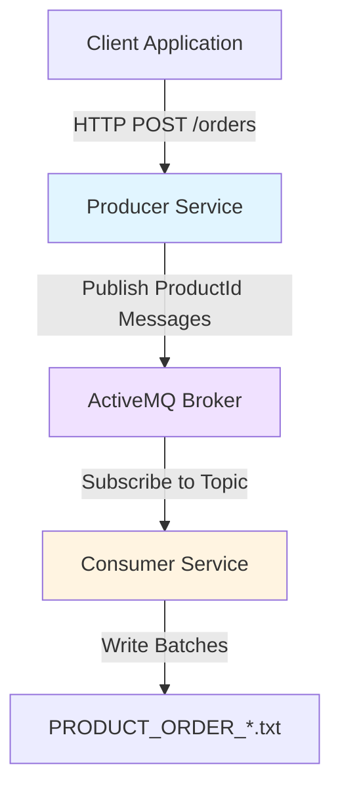

# Order Processing Service

A distributed order processing system built with Java, Spring Boot, and ActiveMQ. This is a Kiro proof-of-concept demonstrating spec-driven development for a producer-consumer messaging architecture.

## Overview

The Order Processing Service demonstrates a distributed messaging architecture where HTTP order requests are decomposed into individual product messages, queued through ActiveMQ, and processed in batches for persistent storage.

### How It Works

1. **Client submits an order** via HTTP POST with an order ID and list of product IDs
2. **Producer decomposes** the order into individual product messages (one per product)
3. **ActiveMQ persists** messages using durable topic subscriptions
4. **Consumer accumulates** products in memory until batch size (5) is reached
5. **Batch is written** to a numbered file in pipe-delimited format

### Example Flow

**Input Request:**
```json
POST /orders
{
  "orderId": "ORD-123",
  "productIds": ["PROD-A", "PROD-B", "PROD-C"]
}
```

**Producer publishes 3 messages to ActiveMQ:**
```json
{"orderId": "ORD-123", "productId": "PROD-A"}
{"orderId": "ORD-123", "productId": "PROD-B"}
{"orderId": "ORD-123", "productId": "PROD-C"}
```

**Consumer accumulates in batch:**
```
Batch: [ORD-123|PROD-A, ORD-123|PROD-B, ORD-123|PROD-C, ...]
```

**When batch reaches 5 products, writes to file:**
```
PRODUCT_ORDER_1.txt:
ORD-123|PROD-A
ORD-123|PROD-B
ORD-123|PROD-C
ORD-456|PROD-X
ORD-456|PROD-Y
```

### Key Characteristics

- **Zero Message Loss**: Durable subscriptions ensure messages are persisted even when consumer is offline
- **Batch Efficiency**: Writing in batches of 5 reduces I/O operations by 80%
- **Automatic Recovery**: Consumer resumes file numbering by scanning existing files on startup
- **Scalable Design**: Topic-based messaging supports multiple independent consumers

## Architecture



### Components

- **Producer Service**: HTTP server that receives order requests and publishes product messages to ActiveMQ
- **Consumer Service**: Message processor that batches products (default: 5 per batch) and writes them to numbered files
- **ActiveMQ Broker**: Message broker providing publish-subscribe messaging via topics

### Key Features

- **Batch Processing**: Products are accumulated in memory and written in batches of 5 to reduce I/O operations
- **Persistent File Counter**: Consumer automatically resumes file numbering after restart by scanning existing files
- **Topic-Based Messaging**: Using ActiveMQ topics for scalable publish-subscribe patterns
- **Pipe-Delimited Output**: Each line in output files follows ORDER_ID|PRODUCT_ID format

## Prerequisites

- Java 17 or higher
- Maven 3.6 or higher
- Docker and Docker Compose

## Quick Start

### 1. Start ActiveMQ

```bash
docker-compose up -d
```

ActiveMQ will be available at:
- OpenWire protocol: `tcp://localhost:61616`
- Web console: `http://localhost:8161` (admin/admin)

### 2. Build the Project

```bash
mvn clean install
```

### 3. Run the Producer

```bash
cd producer
mvn spring-boot:run
```

The Producer HTTP server will start on port 8080.

### 4. Run the Consumer

In a new terminal:

```bash
cd consumer
mvn exec:java -Dexec.mainClass="com.orderprocessing.consumer.ConsumerApplication"
```

The Consumer will start processing messages from ActiveMQ.

## Configuration

### Producer Configuration

Edit `producer/src/main/resources/application.properties`:

```properties
# ActiveMQ Configuration
activemq.broker.url=tcp://localhost:61616
activemq.topic.name=products.topic

# HTTP Server Configuration
server.port=8080

# Logging Configuration
logging.level.com.orderprocessing=INFO
logging.pattern.console=%d{yyyy-MM-dd HH:mm:ss.SSS} [%thread] %-5level %logger{36} - %msg%n
```

### Consumer Configuration

Edit `consumer/src/main/resources/application.properties`:

```properties
# ActiveMQ Configuration
activemq.broker.url=tcp://localhost:61616
activemq.topic.name=products.topic
activemq.client.id=order-consumer-1
activemq.subscription.name=order-subscription

# Batch Configuration
batch.size=5
output.directory.path=./output

# Logging Configuration
logging.level.com.orderprocessing=INFO
logging.pattern.console=%d{yyyy-MM-dd HH:mm:ss.SSS} [%thread] %-5level %logger{36} - %msg%n
```

## API Usage

### Submit an Order

```bash
curl -X POST http://localhost:8080/orders \
  -H "Content-Type: application/json" \
  -d '{
    "orderId": "ORD-123",
    "productIds": ["PROD-1", "PROD-2", "PROD-3"]
  }'
```

**Response:**
- `202 Accepted`: Order accepted and products published
- `400 Bad Request`: Missing orderId or productIds
- `503 Service Unavailable`: ActiveMQ connection unavailable

## Output Files

The Consumer writes batches to numbered files in the output directory:

```
output/
├── PRODUCT_ORDER_1.txt
├── PRODUCT_ORDER_2.txt
└── PRODUCT_ORDER_3.txt
```

Each file contains products in pipe-delimited format:

```
ORD-123|PROD-1
ORD-123|PROD-2
ORD-456|PROD-3
ORD-456|PROD-4
ORD-789|PROD-5
```

## File Counter Persistence

The Consumer automatically resumes file numbering after restart by scanning existing files in the output directory. If files `PRODUCT_ORDER_1.txt` through `PRODUCT_ORDER_5.txt` exist, the next batch will be written to `PRODUCT_ORDER_6.txt`.

## Testing

### Run Unit Tests

```bash
mvn test
```

### Run Integration Tests

```bash
mvn verify
```

## Logging

Both services log to console with the following format:

```
2024-01-15 10:30:45.123 [main] INFO  c.o.producer.ProducerApplication - [Producer] Configuration loaded
```

Log levels can be adjusted in `application.properties`:

```properties
logging.level.com.orderprocessing=INFO
```

## Troubleshooting

### Producer returns 503 Service Unavailable

- Check if ActiveMQ is running: `docker ps`
- Verify ActiveMQ is accessible: `telnet localhost 61616`
- Check Producer logs for connection errors

### Consumer not processing messages

- Verify Consumer is connected to ActiveMQ (check logs)
- Ensure topic name matches in both Producer and Consumer configuration
- Check ActiveMQ web console for message count

### Output files not created

- Verify output directory exists and is writable
- Check Consumer logs for file write errors
- Ensure batch size is reached (default: 5 products)

## Stopping the Services

### Stop Producer

Press `Ctrl+C` in the Producer terminal

### Stop Consumer

Press `Ctrl+C` in the Consumer terminal

### Stop ActiveMQ

```bash
docker-compose down
```

## Project Structure

```
order-processing-service/
├── producer/                   # Producer service (Spring Boot)
│   └── src/main/java/com/orderprocessing/producer/
│       ├── controller/        # REST controllers
│       ├── service/           # Business logic
│       ├── model/             # Data models
│       ├── connection/        # ActiveMQ connection management
│       └── config/            # Spring configuration
├── consumer/                   # Consumer service (standalone Java)
│   └── src/main/java/com/orderprocessing/consumer/
│       ├── messaging/         # Message consumption
│       ├── batch/             # Batch state management
│       ├── file/              # File operations
│       └── model/             # Data models
├── docker-compose.yml         # ActiveMQ container configuration
└── pom.xml                    # Maven parent POM
```

## License

This project is for demonstration purposes.
